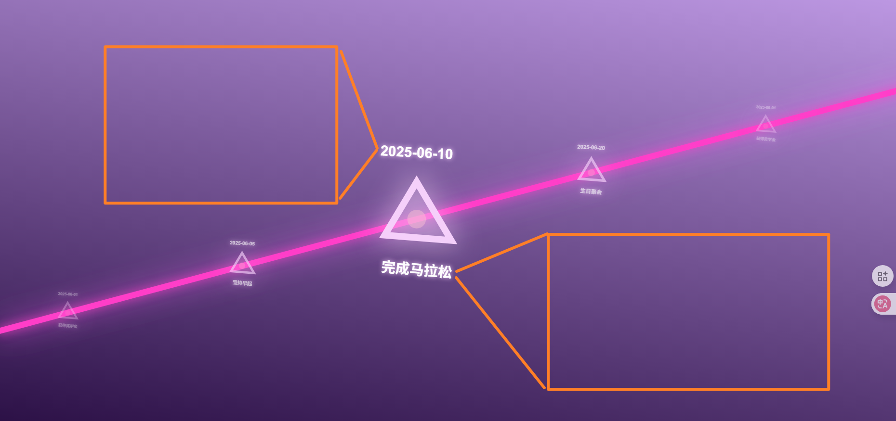
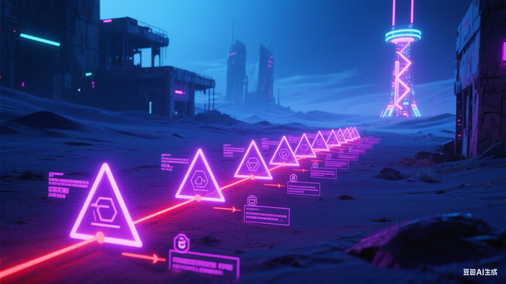

## 项目需求描述（prompt）
> 本项目旨在开发一个个人成长记录型博客网站，具备以下核心功能：
> 1. **时间轴主页**：以横向时间轴为主视图，展示个人成就、习惯养成、里程碑事件、重要时刻等节点。每个节点支持多种内容类型（文本、数字、图片、音频、视频），可点击查看详细内容。
> 2. **多媒体内容管理**：支持图片自动压缩（Sharp.js）、音视频转码（FFmpeg.wasm/后端 FFmpeg），确保多媒体内容高效加载与兼容性。
> 3. **节点搜索功能**：支持关键词检索节点内容，结果以列表形式展示，点击可跳转至对应节点详情。
> 4. **时间轴交互**：支持时间轴的缩放与拖动，交互体验类似 Google 地图时间轴。
> 5. **管理员界面与特殊登录机制**：
>    - 通过访问 `/admin` 路径进入管理员登录页，仅有一个密码输入框。
>    - 常规输入密码无效，把登录功能修改为:当聚焦输入框时,键盘正常输入字符到输入框;当不聚焦输入框时才激活键盘监听,此时会把键盘输入字符保存起来,按下enter时将保存的字符串与"chi"进行比对,若一致则进入管理员模式,否则则清空之前保存的字符,重新记录,不会进入管理员模式.
进入管理员模式后,会跳转到时间轴页面,并增加对节点的增删改操作,以及退出管理员模式的按钮.退出管理员模式后，恢复到普通用户权限。
节点包含以下属性:标题(文本),内容(支持文本、数字、图片、音频、视频mp4),时间,标签(文本).点击节点后,会自动拖动时间轴使该节点位于页面中间,并显示详细内容展示区域,区域位置如图所示:
.
在管理员模式下的时间轴页面里。点击新增节点按钮，可进入节点编辑页面(还包含节点删除,节点保存按钮)，可编辑节点标题、内容、时间、标签等信息.编辑后点击保存按钮，节点信息将保存至数据库并自动更新时间轴;若不点击保存按钮,则退出编辑页面时将忽略此次新增操作,不把新增信息存至数据库.
点击编辑节点按钮后,再点击某个已存在的节点,会弹出对应的编辑页面，允许修改节点标题、内容、时间、标签等信息.编辑后点击保存按钮，节点信息将保存至数据库并自动更新时间轴;若不点击保存按钮,则退出编辑页面时将忽略此次修改操作,不把修改信息存至数据库.
增加删除节点按钮，点击删除节点按钮后，再点击某个已存在的节点，会弹出确认删除提示，确认后将删除该节点，并删除数据库中的该节点信息，并自动更新时间轴。

添加网页背景音乐，循环播放。
> 6. **安全与权限**：仅管理员可操作节点管理，普通用户仅可浏览与搜索。
> 技术选型建议：
> - 前端：React/Next.js 或 Vue/Nuxt.js，TypeScript，现代 UI 框架
> - 后端：Node.js（Express/NestJS）或 Python（FastAPI），RESTful API
> - 数据库：MongoDB 或 PostgreSQL
> - 多媒体处理：Sharp.js、FFmpeg
> - 部署：Vercel/Netlify（前端），云服务器（后端）
> 目标是打造一个高效、美观、易用且安全的个人成长记录平台。
#### 其他
- **前端 UI 框架**：Ant Design（React 生态最佳）
- **部署**：Vercel（前端）、云服务器（后端）
### 其他建议
- **前端 UI 框架**：Ant Design、Material UI、Element Plus（提升开发效率和美观度）
- **认证与安全**：JWT、Session、CSRF 防o

一、整体布局与风格
风格：采用赛博朋克风格，以暗色调（如深蓝、深紫等）为基础，搭配明亮的霓虹色彩（像粉紫、亮红等），营造出科技感与未来感氛围，类似参考图中那种在荒凉场景里融入霓虹元素的视觉效果 。
布局：主视图为时间轴，时间轴呈线性分布（可参考图中类似三角节点串联的形式，也可简化为直线串联节点），贯穿网页主要展示区域，节点沿时间轴排列，背景可设计成带有科技感纹理（如类似沙漠但更具未来废墟或科技场景融合的质感 ），远处有简约化的赛博朋克建筑轮廓点缀（参考图中远处的建筑、高塔形态，简化为剪影或线条勾勒 ）。
二、时间轴及节点
时间轴样式：时间轴线条为醒目的霓虹色（如亮红色，参考图中串联三角的红线 ），线条可设计成带科技感的光效，比如微微闪烁、流动效果 。
节点外观：节点以几何形状为主（参考图中的三角造型，也可适当调整，保持科技感），外观为霓虹发光效果（如粉紫色发光，类似图中三角的色彩 ），节点上可简洁显示节点的关键信息提示（如简短标题、时间等 ）。
节点内容类型：每个节点支持关联文本（详细描述成就、事件等文字内容 ）、数字（如数据统计、达成的数值目标 ）、图片（相关场景、成果照片等 ）、音频（如重要时刻的录音、专属音效 ）、视频（如记录事件的影像 ）等内容，点击节点后可弹出或跳转至详细内容展示区域，详细区域的 UI 延续整体赛博朋克风格，用霓虹元素、科技感边框等装饰 。
三、交互与细节
交互效果：鼠标悬停节点时，节点光效增强、放大，显示简要预览信息（如 “点击查看 [节点标题] 详情” ）；点击节点后，平滑展开详细内容，可设计动态过渡效果，如从节点处弹出面板、淡入等 。
适配性：需考虑不同设备适配，在手机端时间轴可调整为垂直方向滚动排列，节点布局适配手机屏幕尺寸，交互逻辑保持一致（点击展开、悬停预览等 ） 。
拖动时间轴效果要顺着时间轴方向.